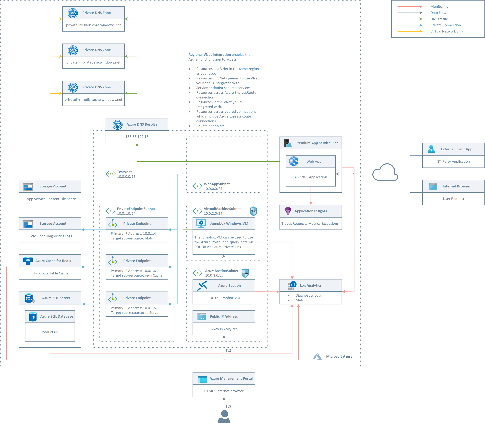
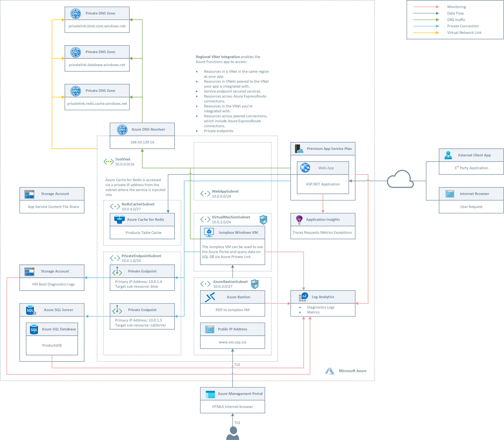
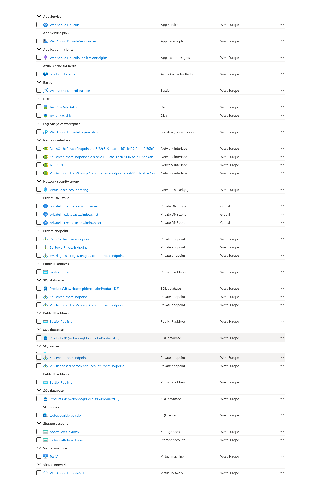
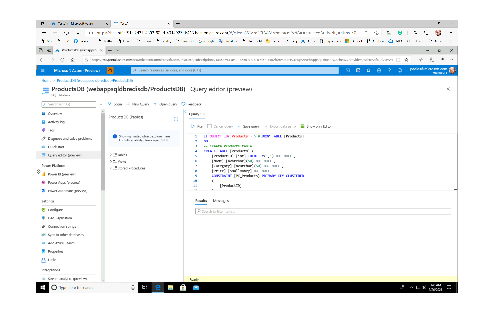
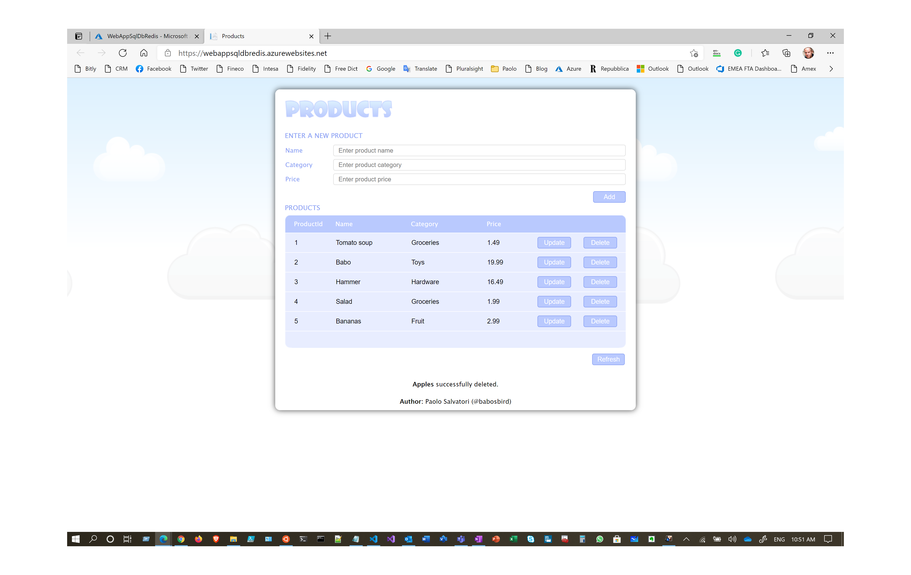

# How to configure a Web App to call Azure Cache for Redis and Azure SQL Database via Private Endpoints

This sample shows how to configure a Web App running in an [Azure App Service](https://docs.microsoft.com/en-us/azure/app-service/) an [HTTP-triggered Azure Web App](https://docs.microsoft.com/en-us/azure/azure-functions/functions-bindings-http-webhook-trigger?tabs=csharp) to access [Azure Cache for Redis](https://docs.microsoft.com/en-us/azure/azure-cache-for-redis/cache-overview) and [Azure SQL Database](https://docs.microsoft.com/en-us/azure/azure-sql/database/sql-database-paas-overview) using [Azure Private Endpoints](https://docs.microsoft.com/azure/private-link/private-endpoint-overview). The Azure Web Apps app is hosted in [Azure Web Apps Premium Plan](https://docs.microsoft.com/en-us/azure/azure-functions/functions-premium-plan?tabs=portal) with [Regional VNET Integration](https://docs.microsoft.com/en-us/azure/app-service/web-sites-integrate-with-vnet#regional-vnet-integration).
Private endpoints are fully supported also by the Standard tier of Azure Cache for Redis. However, to use private endpoints, an Azure Cache for Redis instance needs to have been created after July 28th, 2020. Currently, geo-replication, firewall rules, portal console support, multiple endpoints per clustered cache, persistence to firewall and VNet injected caches is not supported.
As an alternative solution, this sample also shows how to deploy Premium Azure Cache for Redis in a virtual neytwork. When an Azure Cache for Redis instance is configured with a virtual network is not publicly addressable and can only be accessed from virtual machines and applications within the virtual network or a peered virtual network.

For more information, see:

- [Azure Private Link for Azure SQL Database and Azure Synapse Analytics](https://docs.microsoft.com/en-us/azure/azure-sql/database/private-endpoint-overview)
- [Web app private connectivity to Azure SQL database](https://docs.microsoft.com/en-us/azure/architecture/example-scenario/private-web-app/private-web-app)
- [Azure Cache for Redis with Azure Private Link](https://docs.microsoft.com/en-us/azure/azure-cache-for-redis/cache-private-link)
- [Configure virtual network support for a Premium Azure Cache for Redis instance](https://docs.microsoft.com/en-us/azure/azure-cache-for-redis/cache-how-to-premium-vnet)

In addition, Azure Web Apps and Http-triggered Azure Web Apps can be configured to be called via a private IP address by applications located in the same virtual network, or in a peered network, or on-premises via ExpressRoute or a S2S VPN. For more information, see:

- [Using Private Endpoints for Azure Web App](https://docs.microsoft.com/en-us/azure/app-service/networking/private-endpoint).
- [Create an App Service app and deploy a private endpoint by using an Azure Resource Manager template](https://docs.microsoft.com/en-us/azure/app-service/scripts/template-deploy-private-endpoint).
- [Call an HTTP Azure Web App using a Private Endpoint](https://github.com/paolosalvatori/azure-functions-private-endpoint-http-trigger)

For a similar sample with a non-HTTP-triggered Azure Web App, see [Azure Web Apps, Private Endpoints, and NAT Gateway](https://github.com/paolosalvatori/azure-function-premium-plan).

## Deploy to Azure

You can use the following button to deploy the demo to your Azure subscription:

Azure Cache for Redis via Private Endpoints

[](https://portal.azure.com/#create/Microsoft.Template/uri/https%3A%2F%2Fraw.githubusercontent.com%2Fpaolosalvatori%2Fweb-app-redis-sql-db%2Fmaster%2Ftemplates%2Fazuredeploy.endpoint.json%3Ftoken%3DAAIW4AOWATWNQLL2JZKDBAK63EOOU)

Azure Cache for Redis in a virtual network

[](https://portal.azure.com/#create/Microsoft.Template/uri/https%3A%2F%2Fraw.githubusercontent.com%2Fpaolosalvatori%2Fweb-app-redis-sql-db%2Fmaster%2Ftemplates%2Fazuredeploy.endpoint.json%3Ftoken%3DAAIW4AOWATWNQLL2JZKDBAK63EOOU)

## Architecture

The following picture shows the architecture and network topology of the first solution where a Standard Azure Cache for Redis is accessed by an Azure Web App via [Regional VNET Integration](https://docs.microsoft.com/en-us/azure/app-service/web-sites-integrate-with-vnet#regional-vnet-integration) and [Azure Private Endpoints](https://docs.microsoft.com/azure/private-link/private-endpoint-overview).



The ARM template deploys the following resources:

- Virtual Network: this virtual network is composed of the following subnets:
  - **WebAppSubnet**: this subnet is used for the regional VNET integration with the Azure Web App app hosted by a Premium Plan. For more information, see [Using Private Endpoints for Azure Web App](https://docs.microsoft.com/en-us/azure/app-service/networking/private-endpoint).
  - **PrivateEndpointSubnet**: hosts the private endpoints used by the application.
  - **VirtualMachineSubnet**: hosts the jumpbox virtual machine and any additional virtual machine used by the solution.
  - **AzureBastionSubnet**: hosts Azure Bastion. For more information, see [Working with NSG access and Azure Bastion](https://docs.microsoft.com/en-us/azure/bastion/bastion-nsg).
- Network Security Group: this resource contains an inbound rule to allow access to the jumpbox virtual machine on port 3389 (RDP)
- A Windows 10 virtual machine. This virtual machine can be used as jumpbox virtual machine to simulate a real application and send requests to the Azure Web Apps exposed via [Azure Private Link](https://docs.microsoft.com/en-us/azure/private-link/private-link-overview).
- A Public IP for Azure Bastion
- Azure Bastion is used to access the jumpbox virtual machine from the Azure Portal via RDP. For more information, see [What is Azure Bastion?](https://docs.microsoft.com/en-us/azure/bastion/bastion-overview).
- An ADLS Gen 2 storage account used to store the boot diagnostics logs of the virtual machine as blobs
- An ADLS Gen 2 storage account where the code and configuration of the Azure Web App are stored. For more information, see [WEBSITE_CONTENTAZUREFILECONNECTIONSTRING](https://docs.microsoft.com/it-it/azure/azure-functions/functions-app-settings#website_contentazurefileconnectionstring).
- An Premium App Service Plan hosting the Azure Web App app. For more information, see [Azure App Service plan overview](https://docs.microsoft.com/en-us/azure/app-service/overview-hosting-plans).
- An Azure App Service containing an ASP.NET Web App that uses Azure Cache for Redis to cache the data of a Products table hosted in [Azure SQL Database](https://docs.microsoft.com/en-us/azure/azure-sql/database/sql-database-paas-overview).
- An Application Insights resource used by the Azure Web Apps app to store logs, traces, requests, exceptions, and metrics. For more information, see [Monitor Azure Web Apps](https://docs.microsoft.com/en-us/azure/azure-functions/functions-monitoring).
- An Azure SQL Server and [Azure SQL Database](https://docs.microsoft.com/en-us/azure/azure-sql/database/sql-database-paas-overview) hosting the ProductDB relational database used by the Web App.
- A private endpoint to the:

  - Azure Blob storage account (boot diagnostics logs)
  - Azure Cache for Redis
  - Azure SQL Database

- A Private DNS Zone Group to link each private endpoint with the corresponding Private DNS Zone.
- The NIC used by the jumpbox virtual machine and for each private endpoint.
- A Log Analytics workspace used to monitor the health status of the services such as the hosting plan or NSG.
- A Private DNS Zone for Azure Blob Storage Account private endpoints (privatelink.blob.core.windows.net)
- A Private DNS Zone for Azure Cache for Redis private endpoints (privatelink.redis.cache.windows.net)
- A Private DNS Zone for Azure SQL Database private endpoints (privatelink.database.windows.net)

The following picture shows the architecture and network topology of the first solution where a Standard Azure Cache for Redis is accessed by an Azure Web App via [Regional VNET Integration](https://docs.microsoft.com/en-us/azure/app-service/web-sites-integrate-with-vnet#regional-vnet-integration) and [Azure Private Endpoints](https://docs.microsoft.com/azure/private-link/private-endpoint-overview).



The ARM template deploys the following resources:

- Virtual Network: this virtual network is composed of the following subnets:
  - **WebAppSubnet**: this subnet is used for the regional VNET integration with the Azure Web App app hosted by a Premium Plan. For more information, see [Using Private Endpoints for Azure Web App](https://docs.microsoft.com/en-us/azure/app-service/networking/private-endpoint).
  - **PrivateEndpointSubnet**: hosts the private endpoints used by the application.
  - **VirtualMachineSubnet**: hosts the jumpbox virtual machine and any additional virtual machine used by the solution.
  - **AzureBastionSubnet**: hosts Azure Bastion. For more information, see [Working with NSG access and Azure Bastion](https://docs.microsoft.com/en-us/azure/bastion/bastion-nsg).
  - **RedisCacheSubnet**: hosts the Premium Azure Cache for Redis
- Network Security Group: this resource contains an inbound rule to allow access to the jumpbox virtual machine on port 3389 (RDP)
- A Windows 10 virtual machine. This virtual machine can be used as jumpbox virtual machine to simulate a real application and send requests to the Azure Web Apps exposed via [Azure Private Link](https://docs.microsoft.com/en-us/azure/private-link/private-link-overview).
- A Public IP for Azure Bastion
- Azure Bastion is used to access the jumpbox virtual machine from the Azure Portal via RDP. For more information, see [What is Azure Bastion?](https://docs.microsoft.com/en-us/azure/bastion/bastion-overview).
- An ADLS Gen 2 storage account used to store the boot diagnostics logs of the virtual machine as blobs
- An ADLS Gen 2 storage account where the code and configuration of the Azure Web App are stored. For more information, see [WEBSITE_CONTENTAZUREFILECONNECTIONSTRING](https://docs.microsoft.com/it-it/azure/azure-functions/functions-app-settings#website_contentazurefileconnectionstring).
- An Premium App Service Plan hosting the Azure Web App app. For more information, see [Azure App Service plan overview](https://docs.microsoft.com/en-us/azure/app-service/overview-hosting-plans).
- An Azure App Service containing an ASP.NET Web App that uses Azure Cache for Redis to cache the data of a Products table hosted in [Azure SQL Database](https://docs.microsoft.com/en-us/azure/azure-sql/database/sql-database-paas-overview).
- An Application Insights resource used by the Azure Web Apps app to store logs, traces, requests, exceptions, and metrics. For more information, see [Monitor Azure Web Apps](https://docs.microsoft.com/en-us/azure/azure-functions/functions-monitoring).
- An Azure SQL Server and [Azure SQL Database](https://docs.microsoft.com/en-us/azure/azure-sql/database/sql-database-paas-overview) hosting the ProductDB relational database used by the Web App.
- A private endpoint to the:

  - Azure Blob storage account (boot diagnostics logs)
  - Azure SQL Database

- A Private DNS Zone Group to link each private endpoint with the corresponding Private DNS Zone.
- The NIC used by the jumpbox virtual machine and for each private endpoint.
- A Log Analytics workspace used to monitor the health status of the services such as the hosting plan or NSG.
- A Private DNS Zone for Azure Blob Storage Account private endpoints (privatelink.blob.core.windows.net)
- A Private DNS Zone for Azure SQL Database private endpoints (privatelink.database.windows.net)

## Important Notes

The two ARM templates disable the public access to both Azure SQL Database and Azure Cache for Redis via the `publicNetworkAccess` parameter which default value is set to `false`. Using private endpoints is not enough to secure an application, you also have to disable the public access to the managed services used by the application, in this case Azure SQL Database and Azure Cache for Redis.

In addition, both ARM templates automatically create the connection string to both the Azure Cache for Redis and Azure SQL Database as application settings of the Azure App Service. However, in a production environment, it's recommended to access adopt one of the following approaches:

- Use a system assigned managed identity from the Web App to access Azure SQL Database. For more information, see [](https://docs.microsoft.com/en-us/azure/app-service/app-service-web-tutorial-connect-msi). For more information about the Azure Services that support managed identities, see [Services that support managed identities for Azure resources](https://docs.microsoft.com/en-us/azure/active-directory/managed-identities-azure-resources/services-support-managed-identities).
- Store sensitive data like connection strings, encryption keys, certificates, and connection string in [Azure Key Vault](https://docs.microsoft.com/en-us/azure/key-vault/general/overview). For more information, see [Tutorial: Use a managed identity to connect Key Vault to an Azure web app in .NET](https://docs.microsoft.com/en-us/azure/key-vault/general/tutorial-net-create-vault-azure-web-app).

## Prerequisites

The following components are required to run this sample:

- [.NET Framework](https://dotnet.microsoft.com/download/dotnet-framework/net48)
- [Visual Studio Code](https://code.visualstudio.com/)
- [Azure CLI](https://docs.microsoft.com/cli/azure/install-azure-cli?view=azure-cli-latest)
- [Azure Web Apps Core Tools](https://docs.microsoft.com/azure/azure-functions/functions-run-local)
- [Azure subscription](https://azure.microsoft.com/free/)

## Topology Deployment

You can use the ARM template and Bash script included in the sample to deploy to Azure the entire infrastructure necessary to host the demo:

```sh
#!/bin/bash

# Clear the screen
clear

# Print the menu
echo "================================================="
echo "Install Demo. Choose an option (1-3): "
echo "================================================="
options=("Inject Premium Azure Cache for Redis in a VNET"
         "Azure Cache for Redis with Azure Private Link"
         "Quit")

# Select an option
COLUMNS=0
select opt in "${options[@]}"; do
    case $opt in
    "Inject Premium Azure Cache for Redis in a VNET")
        template="../templates/azuredeploy.vnet.json"
        parameters="../templates/azuredeploy.vnet.parameters.json"
        resourceGroupName="WebAppSqlDbRedisInVnetRG"
        break
        ;;
    "Azure Cache for Redis with Azure Private Link")
        template="../templates/azuredeploy.endpoint.json"
        parameters="../templates/azuredeploy.endpoint.parameters.json"
        resourceGroupName="WebAppSqlDbRedisCacheRG"
        break
        ;;
    "Quit")
        exit
        ;;
    *) echo "invalid option $REPLY" ;;
    esac
done

# Variables
location="WestEurope"

# SubscriptionId of the current subscription
subscriptionId=$(az account show --query id --output tsv)
subscriptionName=$(az account show --query name --output tsv)

# Check if the resource group already exists
createResourceGroup() {
    local resourceGroupName=$1
    local location=$2

    # Parameters validation
    if [[ -z $resourceGroupName ]]; then
        echo "The resource group name parameter cannot be null"
        exit
    fi

    if [[ -z $location ]]; then
        echo "The location parameter cannot be null"
        exit
    fi

    echo "Checking if [$resourceGroupName] resource group actually exists in the [$subscriptionName] subscription..."

    if ! az group show --name "$resourceGroupName" &>/dev/null; then
        echo "No [$resourceGroupName] resource group actually exists in the [$subscriptionName] subscription"
        echo "Creating [$resourceGroupName] resource group in the [$subscriptionName] subscription..."

        # Create the resource group
        if az group create --name "$resourceGroupName" --location "$location" 1>/dev/null; then
            echo "[$resourceGroupName] resource group successfully created in the [$subscriptionName] subscription"
        else
            echo "Failed to create [$resourceGroupName] resource group in the [$subscriptionName] subscription"
            exit
        fi
    else
        echo "[$resourceGroupName] resource group already exists in the [$subscriptionName] subscription"
    fi
}

# Validate the ARM template
validateTemplate() {
    local resourceGroupName=$1
    local template=$2
    local parameters=$3
    local arguments=$4

    # Parameters validation
    if [[ -z $resourceGroupName ]]; then
        echo "The resource group name parameter cannot be null"
    fi

    if [[ -z $template ]]; then
        echo "The template parameter cannot be null"
    fi

    if [[ -z $parameters ]]; then
        echo "The parameters parameter cannot be null"
    fi

    echo "Validating [$template] ARM template..."

    if [[ -z $arguments ]]; then
        error=$(az deployment group validate \
            --resource-group "$resourceGroupName" \
            --template-file "$template" \
            --parameters "$parameters"  2>&1 | grep 'ERROR:')
    else
        error=$(az deployment group validate \
            --resource-group "$resourceGroupName" \
            --template-file "$template" \
            --parameters "$parameters" \
            --arguments $arguments   2>&1 | grep 'ERROR:')
    fi

    if [[ -z $error ]]; then
        echo "[$template] ARM template successfully validated"
    else
        echo "Failed to validate the [$template] ARM template"
        echo "$error"
        exit 1
    fi
}

# Deploy ARM template
deployTemplate() {
    local resourceGroupName=$1
    local template=$2
    local parameters=$3
    local arguments=$4

    # Parameters validation
    if [[ -z $resourceGroupName ]]; then
        echo "The resource group name parameter cannot be null"
        exit
    fi

    if [[ -z $template ]]; then
        echo "The template parameter cannot be null"
        exit
    fi

    if [[ -z $parameters ]]; then
        echo "The parameters parameter cannot be null"
        exit
    fi

    # Deploy the ARM template
    echo "Deploying [$template] ARM template..."

    if [[ -z $arguments ]]; then
         az deployment group create \
            --resource-group $resourceGroupName \
            --template-file $template \
            --parameters $parameters 1>/dev/null
    else
         az deployment group create \
            --resource-group $resourceGroupName \
            --template-file $template \
            --parameters $parameters \
            --parameters $arguments 1>/dev/null
    fi

    if [[ $? == 0 ]]; then
        echo "[$template] ARM template successfully provisioned"
    else
        echo "Failed to provision the [$template$] ARM template"
        exit -1
    fi
}

# Create Resource Group
createResourceGroup \
    "$resourceGroupName" \
     "$location"

# Validate ARM Template
validateTemplate \
    "$resourceGroupName" \
    "$template" \
    "$parameters"

# Deploy ARM Template
deployTemplate \
    "$resourceGroupName" \
    "$template" \
    "$parameters"
```

The following figure shows the Azure resources grouped by type deployed by the `azuredeploy.endpoint.json`ARM template in the target resource group.



## Create the database

You can use the `ProductsDB` T-SQL script to create the database used by the companion application. You can proceed as follows:

- VPN into the jumpbox virtual machine using Azure Bastion as shown in the picture below
- Open a browser and connect to the Azure Portal
- Open the Query Editor under the Azure SQL Database resource
- Copy and paste the code in `ProductsDB` T-SQL script into a new query
- Execute the scripts that creates the tables and some test data in the Products table used by the Web App



## Deploy the code of the Azure Web App

Once the Azure resources have been deployed to Azure (which can take about 10-12 minutes), you need to deploy the Azure Web App contained in the src folder to the newly created Azure Web App app. Each Azure Web App app has an Advanced Tool (Kudu) site that is used to manage web app deployments. This site is accessed from a URL like: <WEB_APP_NAME>.scm.azurewebsites.net. You can use [Visual Studio Code](https://code.visualstudio.com/) or [Visual Studio](https://visualstudio.microsoft.com/) to deploy the code of the companion ASP.NET application to the Azure App Service created by the ARM template.

## Test the Application

After creating the database and deploying the Web App, you can simply navigate to the URL of your Azure App Service to check if the application is up and running, as shown in the following figure.


